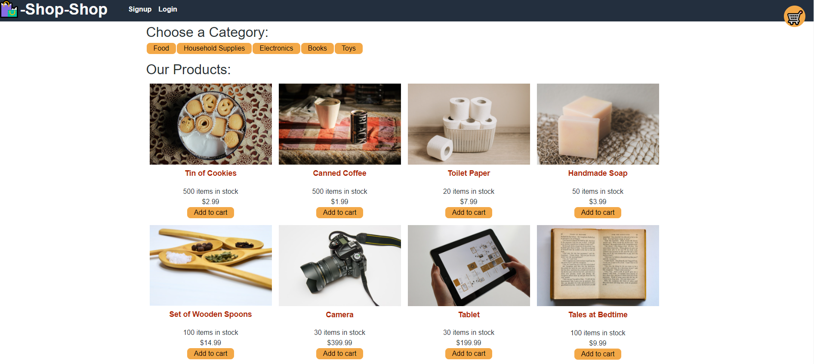

# Redux-React
A shopping application that uses redux to manage global a global state.  The code was refactored from using a Context API to using Redux.  Significant changes include adding `slices` to manage updating, removing, and adding items.

***
### Deployed application: [here](https://react-redux-jtn.herokuapp.com/)
***

## Table of contents
* [Description](#description)
* [Installation](#installation)
* [Usage and links](#usage)
* [License](#license)
* [Contributors](#contributors)
* [Tests](#tests)
* [Questions](#questions)

## Description

A simple shopping application that simulates purchasing items and allowing the user to modify their current cart contents.  The user will be able to sign up and login securely, while also being able to save their cart items for when they leave and visit the site again.

## Installation

For online deployment to heroku (requires MongoDB):
<ol>
<li>Set up a Heroku app by accessing <a href='dashboard.heroku.com/apps'>your heroku dashboard</a> and creating a new app.</li>
<li>Optional: Fork or clone the repository to your own GitHub account.</li>
<li>Set up heroku to auto-deploy from your GitHub repository of choice in the <code>deploy</code> tab. </li>
<li>Enable connection to an existing database in Mongo DB</li>
<li>When the application has finished building and deploying, open the app and explore the features.</li>
</ol>

For offline use (requires prior installation of mongoDB and nodejs):

Clone down the repository or download and extract from a zipped folder.
<ol>
<li>Clone down the repository or download and extract from a zipped folder.</li>
<li>Access the root folder in a terminal.</li>
<li>Install packages by entering <code>npm i</code></li>
<li>From the root folder, add seed data by entering <code>npm run seed </code>in the terminal</li>
<li>Run the application by entering <code>npm run develop</code> within the root folder</li>
</ol>

This application is run via MERN (`MongoDB`, `Express`, `React`, `Nodejs`).

NPM packages required (`npm i` to install all the packages):

Packages used:
<ul>
<li><a href="https://www.npmjs.com/package/express">Express</a></li>
<li><a href="https://www.npmjs.com/package/mongoose">Mongoose</a></li>
<li><a href="https://www.npmjs.com/package/concurrently">Concurrently</a></li>
<li><a href="https://www.npmjs.com/package/graphql">Graphql</a></li>
<li><a href="https://www.npmjs.com/package/bcrypt">bcrypt</a></li>
<li><a href="https://www.npmjs.com/package/jsonwebtoken">jsonwebtoken</a></li>
<li><a href="https://www.npmjs.com/package/apollo-server-express">Apollo-server-express</a></li>
<li><a href="https://reactjs.org/">React</a></li>
<li><a href="https://www.npmjs.com/package/@apollo/client">@apollo/client</a></li>
<li><a href='https://redux.js.org'>Redux</a></li>
<li><a href='https://stripe.com/docs/js'>Stripe</a></li>
</ul>

Optional: 
[nodemon](https://www.npmjs.com/package/nodemon)

Run `npm run develop` to start both the client and server on ports 3000 and 3001 respectively.

The graphql playground can be accessed via http://www.localhost:3001/graphql which defaults to port 3001.

## Usage

<a href = 'https://drive.google.com/file/d/13RK5cCItBZbFsSWM8-YPX_CXVnp9keym/view'> A video demonstration </a>

Github repository: [click here.](#)

## License

This application is licensed under [MIT]((https://opensource.org/licenses/MIT)).

## Contributors

Anyone can contribute to this project.

## Tests

No tests available.

## Questions
Have a question? Please email me at johnnytrucnguyen@gmail.com

[My Github](https://www.github.com/nguyenjohnnyt)
